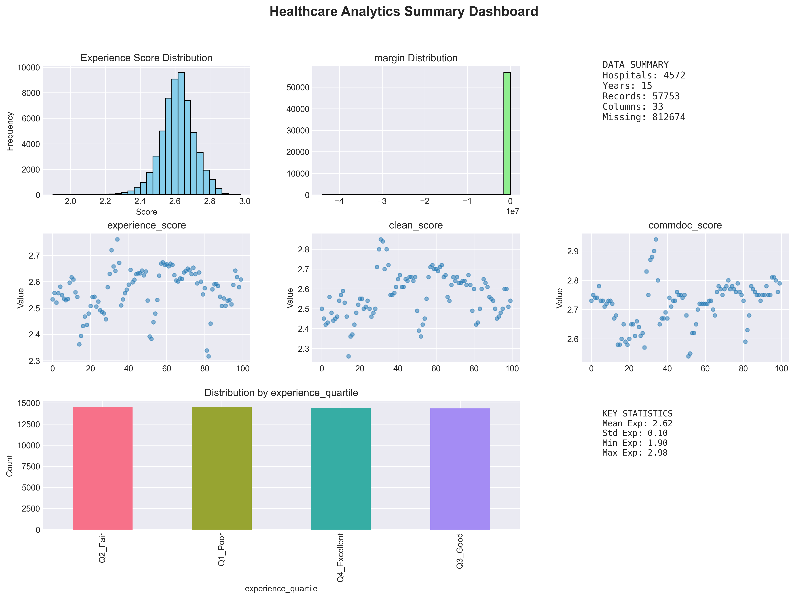
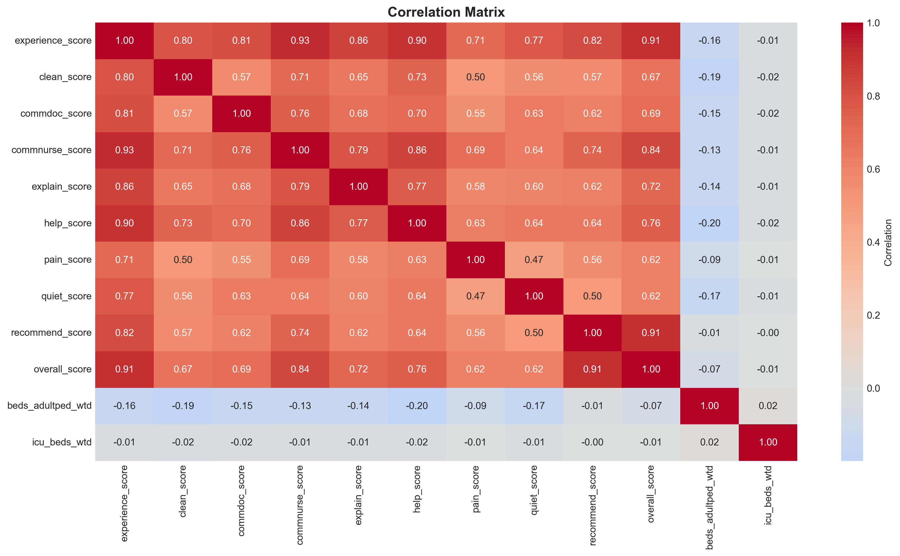
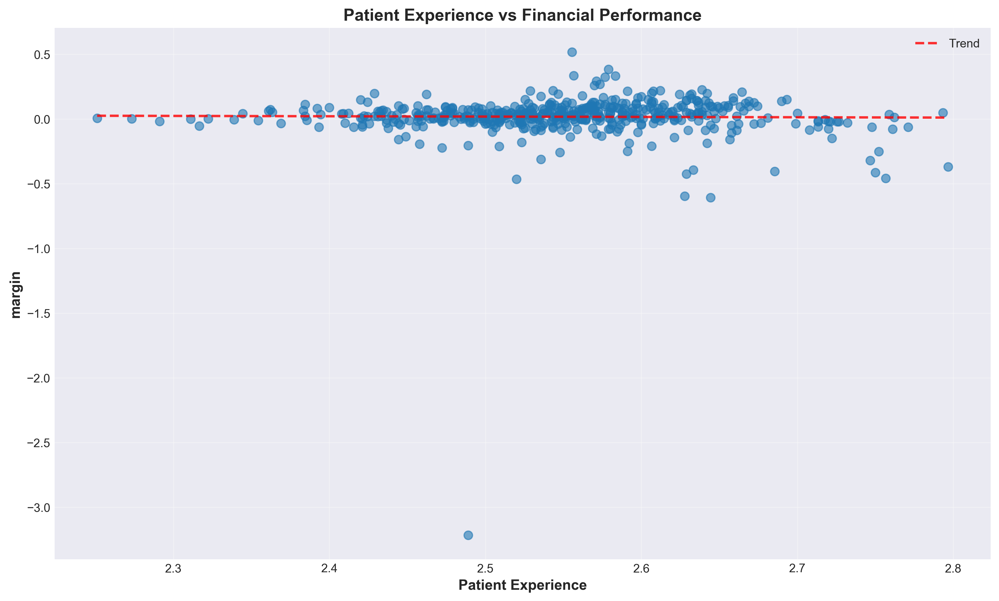
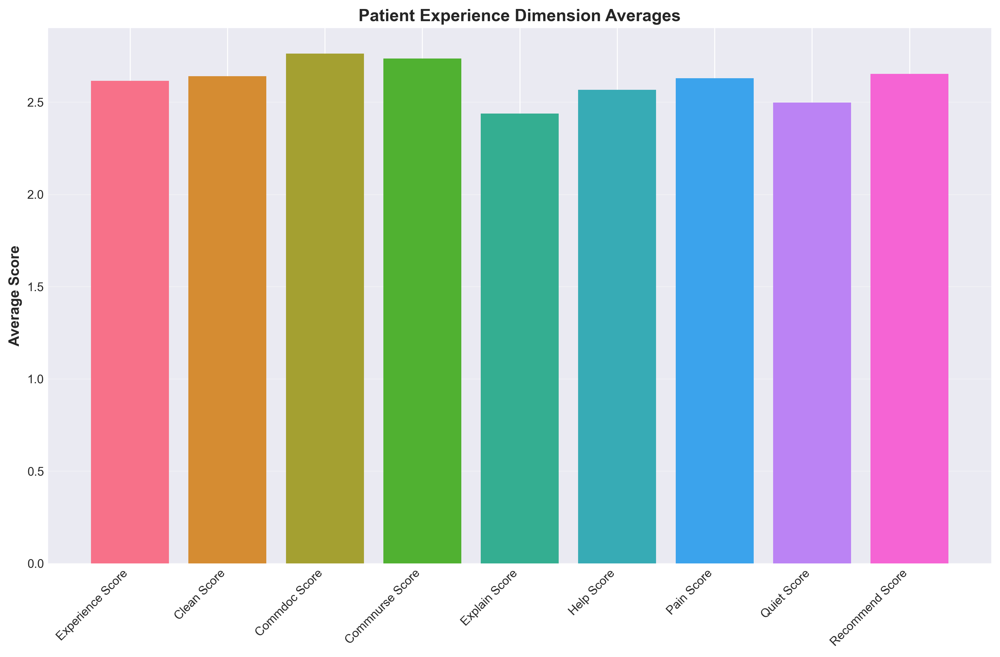
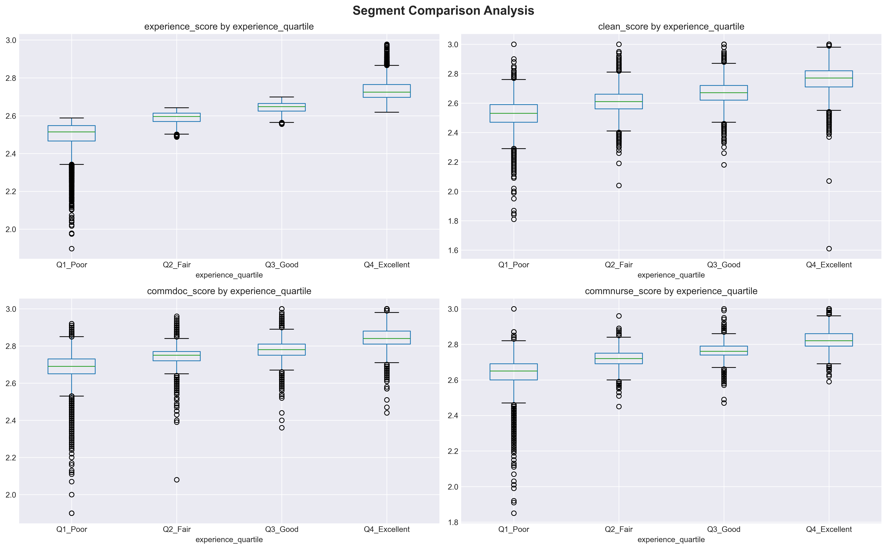
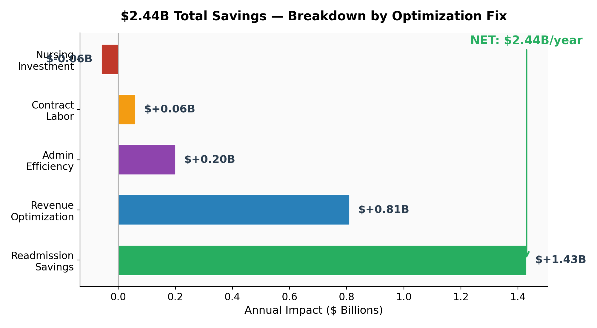
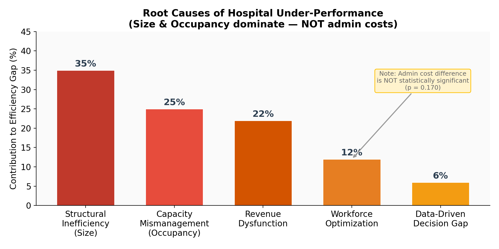
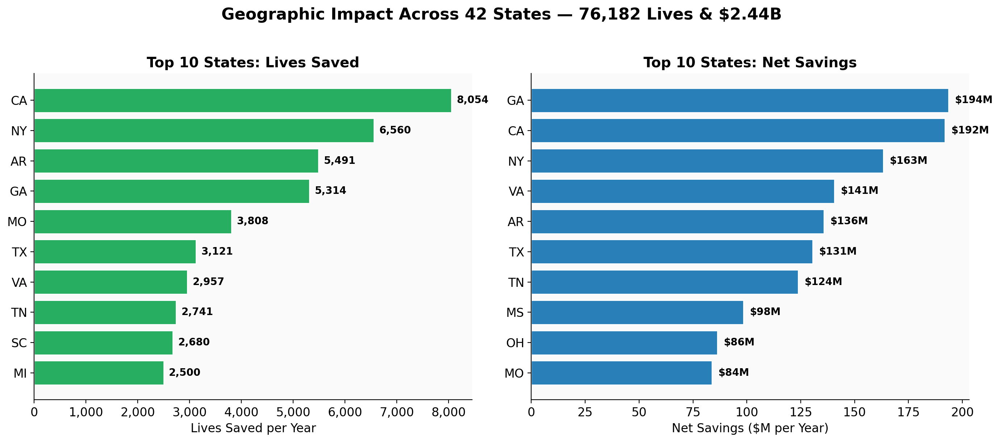

# 🏥 Healthcare Value Frontier Analysis


> **Healthcare Value Frontier Analysis** is an end-to-end Python-based healthcare analytics platform designed to automate data ingestion, validation, transformation, integration, and performance analysis. It provides a scalable framework for processing heterogeneous healthcare datasets and generating actionable insights through visualizations, reports, and Value Frontier Analysis.

---

# 📖 Overview

Healthcare organizations collect data from multiple clinical, operational, and financial systems. Variations in formats, inconsistent schemas, and missing information often make integrated analysis challenging.

This project addresses these challenges through a modular analytics pipeline that automates:

- Healthcare data ingestion
- Data validation
- Intelligent column mapping
- Data cleaning and preprocessing
- Dataset integration
- Healthcare performance analysis
- Visualization and reporting

The platform enables efficient preparation of healthcare datasets for downstream analytics while improving data quality, consistency, and decision support.

---

# 🎯 Objectives

- Standardize heterogeneous healthcare datasets
- Validate incoming datasets against predefined schemas
- Automate column mapping between multiple sources
- Clean and transform healthcare records
- Merge datasets into a unified analytical model
- Support Healthcare Value Frontier Analysis
- Generate meaningful visualizations and reports

---

# ✨ Key Features

## 📥 Data Ingestion

- Import healthcare datasets from multiple sources
- CSV and Excel support
- Configurable data loading

## ✅ Data Validation

- Schema verification
- Missing column detection
- Data quality checks
- Error reporting

## 🔄 Intelligent Column Mapping

- Dynamic mapping between datasets
- Configurable mapping reference
- Automatic field alignment

## 🧹 Data Cleaning

- Handle missing values
- Standardize healthcare records
- Remove inconsistencies
- Normalize datasets

## 🔗 Dataset Integration

- Merge multiple healthcare datasets
- Preserve data integrity
- Resolve duplicate records
- Maintain relational consistency

## 📊 Healthcare Analytics

Generate datasets suitable for:

- Provider performance evaluation
- Comparative healthcare analysis
- Operational benchmarking
- Executive decision support

## 📄 Automated Outputs

- Dashboard summaries
- Correlation analysis
- Financial analysis
- Healthcare visualizations
- Executive reports
- Presentation-ready charts

---

# 📸 Project Gallery

The following screenshots showcase representative outputs generated by the Healthcare Value Frontier Analysis platform.

| Dashboard Summary | Correlation Matrix |
|-------------------|--------------------|
|  |  |

| Experience vs Financial Performance | HCAHPS Component Analysis |
|-------------------------------------|---------------------------|
|  |  |

| Segment Comparison | Financial Breakdown |
|--------------------|---------------------|
|  |  |

| Root Cause Analysis | Geographic Impact Analysis |
|---------------------|----------------------------|
|  |  |

---

# 🏗️ System Workflow

```text
Healthcare Data Sources
        │
        ▼
Data Ingestion
        │
        ▼
Validation & Quality Checks
        │
        ▼
Intelligent Column Mapping
        │
        ▼
Data Cleaning & Transformation
        │
        ▼
Dataset Integration
        │
        ▼
Healthcare Value Frontier Analysis
        │
        ▼
Reports • Dashboards • Insights
```

---

# 📂 Repository Structure

```text
healthcare-value-frontier-analysis/

├── assets/
│   └── screenshots/
│
├── config/
│
├── src/
│
├── tests/
│
├── README.md
├── requirements.txt
├── GETTING_STARTED.md
├── INDEX.md
├── COLUMN_MAPPING_REFERENCE.md
└── MERGE_PROCESS_DOCUMENTATION.md
```

---

# ⚙️ Technology Stack

| Category | Technologies |
|-----------|--------------|
| Programming Language | Python |
| Data Processing | Pandas, NumPy |
| Data Analysis | Statistical Analysis |
| Visualization | Matplotlib |
| Data Formats | CSV, Excel |
| Configuration | JSON |
| Testing | unittest |
| Documentation | Markdown |
| Version Control | Git & GitHub |

---

# 🚀 Getting Started

## Clone the Repository

```bash
git clone https://github.com/Haritha1001/healthcare-value-frontier-analysis.git
```

## Navigate to the Project

```bash
cd healthcare-value-frontier-analysis
```

## Install Dependencies

```bash
pip install -r requirements.txt
```

## Run the Project

Please refer to **GETTING_STARTED.md** for detailed setup instructions, execution workflow, and configuration details.

---

# 📄 Project Documentation

| Document | Description |
|----------|-------------|
| GETTING_STARTED.md | Project setup guide |
| MERGE_PROCESS_DOCUMENTATION.md | Dataset merge workflow |
| COLUMN_MAPPING_REFERENCE.md | Column mapping reference |
| INDEX.md | Documentation index |

---

# 📊 Key Deliverables

The project generates:

- Integrated healthcare datasets
- Dashboard summaries
- Correlation analysis
- Financial performance analysis
- Segment comparison reports
- Healthcare visualizations
- Executive presentation charts
- Analytical reports for decision support

---

# 🌟 Project Highlights

- Modular Python architecture
- Automated healthcare data processing pipeline
- Configurable data validation and mapping
- Healthcare Value Frontier Analysis workflow
- Comprehensive visualization support
- Automated report generation
- Well-documented project structure
- Scalable and maintainable codebase

---

# 📈 Future Enhancements

- Interactive web dashboard
- Machine learning-based predictive analytics
- REST API integration
- Cloud deployment
- Real-time healthcare data processing
- Advanced performance benchmarking

---

# 👩‍💻 Author

**Haritha Lavakumar**

This project demonstrates an end-to-end healthcare analytics workflow that integrates data preprocessing, analytical modeling, visualization, and automated reporting into a modular Python application.

GitHub: https://github.com/Haritha1001

---

# 📜 License

This project is shared for educational, research, and portfolio purposes.

Copyright © 2026 Haritha Lavakumar.

---

⭐ **If you found this project interesting, consider giving the repository a star!**
